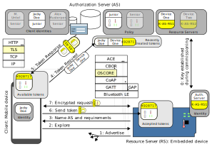

# CoAP/ACE PoC: Project overview

The CoAP/ACE Proof-of-Concept project
demonstrates the use of CoAP[^1], the IETF's standard application protocol for the Internet of Things,
and ACE[^2], the corresponding authorization framework.
It transports CoAP over GATT[^3],
allowing local access from off-the-shelf cell phones
even when connectivity to the Internet is limited.

[^1]: Constrained Application Protocol; [RFC7252] and related documents
[^2]: Authentication and Authorization for Constrained Environments; [RFC9200] and related documents
[^3]: CoAP over GATT is a [work-in-progress standards track specification].
      It transports CoAP over GATT (Generic Attributes),
      which is a widely implemented profile of Bluetooth Low Energy.

[RFC7252]: https://www.rfc-editor.org/rfc/rfc7252.html
[RFC9200]: https://www.rfc-editor.org/rfc/rfc9200.html
[work-in-progress standards track specification]: https://datatracker.ietf.org/doc/id/draft-amsuess-core-coap-over-gatt-02.html

The demo application is executed across three major components:

* An embedded development kit, the Nordic Semiconductors' nRF52-DK,
  the "device",
  stands in for a sensor or actuator device in the field.

  In the context of the ACE framework, it implements the Resource Server (RS) role.

* An authorization server (abbreviated AS in the context of ACE), running in a data center,
  provides security tokens.
  It is configured with symmetric keys for all devices.

* The user's cell phone running a web application provides the user interface.
  It communicates with the authorization server through the Internet (using HTTP),
  and with the device using CoAP over Bluetooth Low Energy (using Web Bluetooth, available on modern Chrome-based browsers).

  In the ACE framework, it implements the Client (C) role.

## Table of Contents

[[_TOC_]]

## Components

*This section describes roles and components of a generalized setup
of which the Proof-of-Concept implements a concrete simple example.*

> *Legend*:
> * Dark gray areas indicate persistent information storage in participants.
>   Light gray areas indicate information stored ephemerally.
> * Large arrows indicate communication steps in their sequence.
>   Icons next to them illustrate the exchanged information during that step.
>   When the arrows end in an information storage, that storage gets filled by that message.
> * Thin gray lines show the path through the network stack a communication step takes.
> * Yellow areas indicate key material.
> * Light yellow areas indicate encrypted layers or information;
>   the encryption key used with them is indicated to their left, and not part of the message.

### Resource Server (Device)

The role of the Resource Server (RS) is implemented on any device that provides functionality accessed through a network.
ACE is designed to allow this role to be played by highly constrained devices:
with the concrete profile used here, there is not even a need for asymmetric cryptography.

The device houses several loosely coupled components:

* The domain application:
  reading sensor values, driving actuators or any control component built on their combination.
* A CoAP application:
  mapping the domain application to CoAP resources, possibly using standardized interfaces.
  This mapping also expresses the minimum properties (typically a "scope") a client needs to provide credentials for for any operation.

  In the figure, the domain and CoAP application are not depicted separately.
* A CoAP stack:
  mapping request coming through the network through the security layer to application requests.
  For easy local communication with user devices,
  this is implemented using the CoAP-over-GATT protocol.

  Note that the security layers used here are "on top" of CoAP.
  This allows applying them consistently on any transport of CoAP.
  For example, a device might offer the same interfaces over Bluetooth and over UDP when connected through a cellular network.
* [OSCORE], CoAP's symmetric security layer.
  It provides message authentication, encryption and integrity protection as well as replay protection.
  In the present setup, it relies on the symmetric key material being provisioned by the Authorization Server (AS)
  through the [ACE OSCORE Profile].
* A shared key with the AS.
  While the RS does not communicate directly with the AS,
  it receives tokens encrypted with this key.
  This key is agreed on as part of the device's commissioning.
* A pool of recently used tokens.
  These tokens are submitted to the RS by the Client,
  which obtains them from the AS.
  The RS decrypts them, and uses the key material contained therein to set up its OSCORE contexts.
  The tokens contain authorizations for particular operations in the application's model,
  which can be as coarse or fine-grained as the application demands,
  and need not be concerned with the roles or identities backing them.
  The RS stores these on a best-effort base;
  when too many clients attempt communication, old tokens can be discarded,
  and will be provided by the clients again.
  
[OSCORE]: https://www.rfc-editor.org/rfc/rfc8613
[ACE OSCORE Profile]: https://www.rfc-editor.org/rfc/rfc9203

### Authorization Server

The Authorization Server (AS) is a central entity that hands out tokens that authorize Clients to access RSes.
It decouples the identities used by the clients from the authorizations understood by the RSes:
Administrators can grant and revoke authorizations
without directly involving the Client or RS,
and the AS can combine the Client's identify with arbitrarily complex policy rules
into the simple authorization statements which the RS can understand
(thereby helping keep the RS simple).

Its conceptual components are:

* A list of shared keys with RSes.
  RSes are labeled with an "audience" identifier.
  The AS also knows enough of the RS's internals
  to express authorizations pertaining to the RS as a "scope" which the RS can understand.
* A means of recognizing authenticated clients,
  along with their identifying information and other properties.
* A policy governing which clients are allowed which operations on which RS.
* A REST interface accessible to clients,
  through which they obtain tokens.

  This is generally recommended in the ACE OSCORE profile to be a CoAP interface.
  For the application in this setup (even generalized from the demo),
  this is realized as an HTTP interface.
  That allows the above recognition of authenticated clients
  to happen through a login inside the browser.
  (See [Client-AS communication] for further discussion).
* Optionally, a pool of recently issued tokens
  to facilitate more efficient token re-validation or upgrades.

### Mobile application

The mobile application takes the Client role in ACE,
and can communicate (not necessarily simultaneously) with both the RS and the AS.
It is a front end user interface.

Its conceptual components are:

* A user interface for the domain application.
* A REST (CoAP, HTTP) stack, which can
  * communicate with the device through CoAP-over-GATT, and
  * communicate with the AS through an interface offered by the AS.
* A client identity usable with the AS.
  Its authorization typically comes from the identity of its user,
  possibly through some form of single-sign-on.
* A pool of tokens usable with RSes.
  This pool is populated ahead of time or on demand
  by requesting a token from the AS for a particular RS.

### Security properties

The protocols utilized in this setup provide a set of security properties
when implemented correctly.
All protocols (OSCORE, ACE, ACE-OSCORE) have undergone (largely extengsive) security review as part of their publication.

#### Summary

The security of the application communication does not depend
on proximity or the security of the underlying network layers
(thus, BLE can be used in "Just Works" mode).
Application data is only exchanged over an encrypted, replay and integrity protected channel,
which is established through the token provided by the AS.

As part of establishing that channel,
both parties are authenticated to the extent necessary:
The client is assured of the RS's identity (represented as the pair of the AS address and the "audience" identifier),
and the RS is assured that the client is some entity known to the AS that may exercise the privileges expressed in the "scope" of the token.

### Terminology and boundaries

When an "active attacker" is mentioned,
it is assumed to have the widest possible wide range of capabilities on the radio side,
but did not compromise any party (Client, AS or RS) or use implementation flaws or side channels.

In this context, "communication metadata" refers to the network addresses of the commmunicating parties,
the amount of data exchanged and the timing of these exchanges.
Communication metadata also covers details such as the matching between requests and responses,
value and presence of sequence numbers and connection identifiers.
Revealing that information is often traded off against bandwidth efficiency;
the choices here (primarily made in OSCORE) are influenced by the typical constraints of IoT devices.
(For example, any padding is purely optional).

Communication metadata can reveal which implementation of the involved protocols is used;
that information is not considered sensitive in this context.

If a Client or an RS is compromised and controlled by an attacker,
the attacker gains the party's privileges until the attack is discovered and the party's privileges revoked at the AS.
This also extends to traffic exchanged before the attack,
provided that the token submission was recorded.
If the key material in a Client is read,
the attacker can impersonate any RS the client has a token with,
even if the Client is otherwise not compromised.
If the key material in an RS is read,
the attacker can impersonate any Client toward the RS indefinitely.

### Per-step details

* Advertisements are unencrypted;
  they reveal that the RS is present and available using the CoAP protocol.
  An active attacker can suppress discovery (e.g. by selective jamming).

* The exploration phase is unencrypted;
  it reveals the client device's presence and use of the ACE-OSCORE profile,
  the address of the AS, and the audience identifier used by the RS (which together identify the RS).

  The use of the EDHOC protocol (see [Asymmetric cryptography])
  would restrict that information to active attackers.

  In the current implementation, it also reveals one action the client would take;
  this is a shortcoming of the discovery discussed in [Discovery and identification].

  An active attacker can make exploration fail.
  If an active attacker alters information in this step,
  no application connection will be established with *that* RS.
  The attacker may present the details of another RS
  (and subsequently redirect traffic to it).
  In that case, the application connection *will* be established with that other device,
  but the user is informed of the device's identity,
  and the attacker gains no access to the encrypted application data.

  In the concrete demo implementation,
  an attacker including the URI of an AS under the attacker's control
  will gain the ability to interact with the user through their web browser.
  This is a deliberate feature of the demo,
  allowing its components to be exchanged separately.
  Production client software would only accept AS URIs with which there is a pre-existing security context.

* Communication between Client and AS is out of scope for this discussion;
  it is based on HTTPS and the chosen authentication methods.

* Submission of the token from the Client to the RS
  transfers the token,
  revealing the continued use of the ACE-OSCORE profile and communication metadata.

  The token itself is encrypted and integrity protected;
  attempts to alter it will result in the rejection of the token.
  Replay of the token will result in the creation of a new security context,
  but successful exchanges through that security context require key material known only to the original parties.

* Once OSCORE communication starts,
  the Client is assured that its peer is the very RS known to the AS under the provided audience identifier.
  The RS is assured that its peer is a Client known to the AS and granted the authorizations indicated in the token.

  Application data is encrypted, replay and integrity protected;
  the keys are exclusively known to the Cleint and the RS,
  and to the AS (which is a trusted party in the first place).
  A passive attacker can see communication metadata.
  An active attacker can delay or interrupt communication,
  but not alter application data.

  A comprehensive survey of attacks is [being developed as "Attacks on CoAP"];
  a state-of-the-art implementation of CoAP and OSCORE
  defeats all but the Blocking Attack,
  provided the application requirements are described and implemented correctly.
  (For example, defeating the Request Delay Attack requires that the application describe precisely any affected resource's freshness requirements).

[being developed as "Attacks on CoAP"]: https://datatracker.ietf.org/doc/draft-ietf-core-attacks-on-coap/

None of these properties depend on the confidentiality of the Bluetooth transport between Client and RS.

The properties do not depend on physical proximity,
but do depend on the user / Client to verify which RS communication was intended with.
Failing that, an attacker can mount a Relay Attack (as defined in "Attacks on CoAP")
and send application communication to a device outside the expected Bluetooth range.
Still, this is limited to devices under the control of an AS the Client is associated with.

## Implementation

Most components that were developed within this project are implemented in the Rust programming language.
This allows easy sharing of code between the mobile application and the embedded device,
and eases experimentation[^exp].
Its rigorous type system lends itself to building high quality implementations
even in a prototyping project (see [Maturities]).

[^exp]: Bluntly speaking, a careless change in a Rust program is just as likely to work as in any other language, but if it does break the application subtly, this is often detected at build time.
[Maturities]: #maturities

### Resource Server (Device)

The demo application for the nRF52-DK development kit
is called [coap-ace-poc-firmware and hosted on GitLab].
Precise instructions for flashing are available in the project's README;
[more detailed documentation] describes how to flash it manually,
and explains its components.

[coap-ace-poc-firmware and hosted on GitLab]: https://gitlab.com/oscore/coap-ace-poc-firmware
[more detailed documentation]: https://oscore.gitlab.io/coap-ace-poc-firmware/doc/coap_ace_poc_firmware/

When built, the application produces a set of firmware images,
which can be programmed onto the development kit by means of drag-and-drop.
These different images are pre-provisioned with keys shared with the Authorization Server,
as well as distinct identities.

The CoAP-over-GATT server is implemented based on the SoftDevice stack, which is provided by and proprietary to the chip's vendor, Nordic Semiconductors.
The domain application, as well as the glue code between the SoftDevice and the CoAP stack
are built on the [embassy framework] for embedded Rust.
The OSCORE layer is provided through Rust bindings to the libOSCORE library.

[embassy framework]: https://embassy.dev/

The domain application consists of three components,
each mapped to a single path,
all of which are mapped to separate scopes:

* reading a simulated temperature (`GET /temp`),
* identifying the device by making its LEDs blink (`POST /identify`) and
* setting the LEDs to be generally active (`POST /leds`).

A significant difference between this demo and deployable devices is that
it provides no runtime modified storage,
i.e. no configuration except what is present at programming time,
no firmware updates,
and no security associations besides the AS.
For timekeeping,
it relies on the demo client to provide a current time stamp rather than on a high precision long-running clock.
See [Time vs. Client-Nonce] for more details.

[Time vs. Client-Nonce]: #time-vs-client-nonce

### Authorization Server

The Authorization Server is implemented as a small Python script,
available as [coap-ace-poc-as on GitLab].
Originally planned as an adaption of RISE's [ACE-Java server],
that turned out to be overly complex for the few tasks that remained in the demo
when it was realized that a CoAP-over-WebSockets transport out of the browser could not carry over HTTP cookie based authentication data
(see [Client-AS communication]).

A running version of the AS is provided on `https://as.coap.amsuess.com/`.
Note that neither the user nor the client application need to be aware of that precise URI:
It is encoded in the RS's responses to unauthorized access.

The server provides only minimal functionality:

* Offering a web front end for logging in as "junior" or "senior".
  As there is no real authentication performed in the demo,
  login is merely a matter of clicking a button,
  which redirects back to the original application with an additional parameter set in the URI's fragment component.
* Offering the `/token` end point of ACE,
  providing tokens for the OSCORE profile.
  
  The token response contains secret key material to be shared between Client and RS
  (twice: once in plain text for the Client, only protected by its HTTPS session with the AS,
  and once encrypted with the RS's key).
  The token also contains scope information,
  which decouples the "junior" and "senior" roles into permissions of the application
  (either may read temperature or identify the device,
  but only the senior may set the LEDs),
  and sets appropriate life times (5 minutes for the Junior, 24 hours for the Senior).

Along with the server code, a list of preconfigured RSes and their keys is stored.

[coap-ace-poc-as on GitLab]: https://gitlab.com/oscore/coap-ace-poc-as
[ACE-Java server]: https://bitbucket.org/marco-tiloca-sics/ace-java.git

### Mobile application

The mobile application is run in a web browser;
it is implemented in Rust using the [yew stack],
and compiled into WebAssembly.
Both its [source code] and the ready-to-use [built version] are hosted and [documented] on GitLab.

[documented]: https://oscore.gitlab.io/coap-ace-poc-webapp/doc/coap_ace_poc_webapp/

The application primarily shows a button for scanning for new devices,
and shows a selection of eligible devices.
This part of the user experience is shaped by the browser:
It enforces that scanning only starts after a user interaction such as clicking a button,
and the list is presented by the browser itself.

The AS responsible for the device is discovered after the device is added.
If the user has not established a login with that AS so far,
a link for logging in is offered.
That link takes the user out of the application,
and back once login is completed.
Any established BLE connections are reset when returning from the login
as a consequence of leaving the page.
In the demo, logins are stored as part of the address,
and can be removed through a button.

With each available device, the user may start any of the interactions offered by the device.
As all of them are limited to authorized users,
these interactions initially fail,
but provide the application with the address of the AS and a scope to request.

To facilitate the demonstration of offline operation,
devices can also be added manually by specifiying their AS URI and RS label (the "audience" field of the token).
The input fields are pre-populated suitably,
only the device number needs adjustment.
Using this interface,
a token can be obtained before even coming within BLE range of the device.
Even after switching the client's network connectivity (WiFi and cellular) off,
the token can be used with the corresponding device once scanned.

Tokens (and their OSCORE security associations) are removed from devices when the device indicates that they are not usable any more
(e.g. when a junior's token has expired 5 minutes after it was created).
OSCORE security associations persist when a device is merely disconnected,
allowing resumption of operations with minimal extra data.
While the demo application tries to establish any missing parts on request,
it does not eagerly (or proactively) try obtaining new components when a request fails.
This is done to make the processes more visible and understandable for the user;
a deployed application would likely retry and re-establish connectivity automatically.

In addition to its domain and ACE functionality,
the client also provides the device with a local time stamp;
[Time vs. Client-Nonce] has more details.

[yew stack]: https://yew.rs/
[source code]: https://gitlab.com/oscore/coap-ace-poc-webapp/
[built version]: https://oscore.gitlab.io/coap-ace-poc-webapp/

### Testing

The [companion document on tests](Tests.md)
describes automated and manual tests the whole system passes.

## Learnings & future development

### Discovery and identification

The demo's discovery model is built on two assumptions:

* Users have no prior knowledge of the precise device they connect to:
  they use Bluetooth proximity to discover any device,
  pick one by name if multiple are around,
  and obtain proof of the device being one under the AS's control when a connection is established.
* There is only one domain application around, and it is known by all involved what it is.

Matching this with deployment realities will need further exploration,
based on anticipated usage patterns.
Concrete mechanisms are available for some aspects,
while others may profit from further development on the ACE and CoAP-over-GATT side:

* Resource Discovery (as specified in [RFC6690]) helps with the discovery of entry points on a device.
  The RS would expose a dedicated discovery resource (`/.well-known/core`)
  that lists entry points at a suitable granularity for the application.

  Authorization may be required already at the resource discovery step.
  Note that if resource discovery is access controlled,
  care has to be taken to alter nonexistent paths' behaviors to match the behavior of existing paths --
  otherwise, the enumeration and characterization resources by an attacker is merely slowed down, not outright prohibited.

* Existing applications built on CoAP sometimes have their own domain specific discovery mechanisms.

  For example, CORECONF (NETCONF / YANG for constrained devices) involves a library discovery step built on (and in parallel to) RFC6690 based discovery.

* All the above discovery mechanisms are only applicable once a device has been connected.

  Expressing available CoAP services,
  the applicable AS
  or even the RS's identity
  in such a way that the mobile application can limit the choices of available BLE devices
  down to an application specific set
  are material for further development of the CoAP-over-GATT specification.

[RFC6690]: https://www.rfc-editor.org/rfc/rfc6690.html

### Time vs. Client-Nonce

The demo performs the highly insecure step of taking the current time
from the client
without any further verification.
This simplification was chosen based on the assumption that realistic sensor or actuator devices
will already have an established way of tracking time.
Using an untrusted time allows an attacker to use a long expired token,
and send a suitable time to trick the RS into accepting it.

ACE offers different ways for the RS to assess the validity of a time-limited token:

* The RS can synchronize its clock with the AS (or with any trusted reliable clock, if some global time scale is used).
* The RS can send a client-nonce to the Client, which the Client then relays to the AS when requesting the token. The client-nonce is then encrypted in the token, confirming to the RS that the token was issued after the first use of that client-nonce.
* The RS can communicate with the AS to explicitly ask for the validity of a given token.
  This option is not further explored here,
  because its benefits are not in requiring less communication,
  but in providing additional services such as revocation without expiry.

Picking between these is particularly hard when at least one of Client and RS have limited connectivity.
We can classify:

1. Both the RS and the Client have good connectivity: 

   Both synchronized clocks and client-nonce are viable options.
   Ideally, participants would support both --
   this allows retaining functionality even under degraded networking conditions.

2. The client has good connectivity, and the RS has none
   (eg. because the RS only acts locally,
   and would only ever need time for communication with local Clients):

   Client-nonces are useful in this case.

3. The RS has good connectivity, and the client has none
   (eg. when a remote RS in an area without cell phone coverage
   is connected to a low-bandwidth sensor network):

   The RS can synchronize clocks with the AS, or another time source.

   The client needs to obtain suitable tokens in advance,
   while it is still connected to the AS;
   this rules out client-nonces.

   It is tempting to place devices with GPS connectivity into this category,
   given that GPS also provides good global time.
   But the GPS time signal can be spoofed with reasonable effort,
   rendering it unsuitable for deployments with high security requirements.

   Note that given the CoAP connectivity established between Client and RS,
   the RS might act as a forward proxy for the client in its request for tokens.
   As the Client is unauthenticated at that time,
   the RS needs to be strict in its proxying,
   and to know all URIs the client may need to reach the AS.

4. Neither the RS nor the Client have network connectivity at the time of their connection,
   and the RS's network connectivity before then is insufficient to synchronize time with the AS.

   This case can only be solved by creatively moving it into one of the previous categories.
   Approaches worth exploring include:

   1. Using long-term stable clocks and long-lived tokens.

      Off the shelf quartz oscillators offer accuracies in the order of magnitude of 20ppm.
      When set up with a global time at commissioning time,
      inaccuracies over even two decades in the field accumulate to mere hours of errors.

      If this is known by the AS and considered in the token life time policy,
      tokens can be issued that are sure to be accepted by the RS for the duration needed.

      In particular for RSes in remote locations,
      the Client would acquire the tokens while still connected to the Internet.
      If these tokens are to be valid until the operator returns to locations with cell phone coverage,
      tokens will need life times exceeding mere hours anyway.

   2. Distributing clock servers near the RS.

      If the RS is part of a sensor network without (or with limited) connectivity to the AS,
      it may make sense to deploy a trusted time server.
      That time server can use the limited connectivity to the AS (or a more general trusted global time source),
      and would be trusted by the RSes inside that sensor network.
      This allows the RSes to use synchronized time.

      The time server is security critical in the sense that a successful attack on it
      allows the attacker to extend the validity of expired tokens.
      Given that the time server is only trusted by local devices,
      it may suffice to protect it just as well as the local RSes.

      A suitable location for such a time server might be the communications uplink,
      as that has the best information available to schedule its requests for accurate time.

   3. Implementing a trusted clock server in the Client.

      Advances in secure execution and trusted computing may enable a setup in which the Client also takes the role of a time server.
      This requires a secure environment that is secure against tampering with its local time.
      This environment is provisioned with key material to authenticate as a time server towards the RS.
      The RS can then obtain a trustworthy time from the device the Client resides in
      before validating the token.

      Note that a similar approach can also be envisioned that shards a part of the AS out to the Client
      (from where it could also respond to token requests containing client-nonces).
      This is not recommended:
      Not only is the fallout of a breach of the trusted environment far greater
      (the attacker could issue tokens for any scope for the RS),
      but the requirements on the execution environment are not less than to a trusted clock server:
      It still needs to be secure against tampering with local time --
      otherwise, the AS could be kept suspended in the trusted environment
      and would issue tokens for client-nonces created at an arbitrary later time.

   4. Moving the Client.

      Obtaining a client-nonce,
      moving the client into a position to communicate with the AS,
      and moving it back to the RS.
      The RS likely needs to be aware of this,
      or might already have expired the client-nonce once the token arrives.

      This is likely to be too cumbersome for practical use.

Adding client-nonce support to Client, RS and AS
is a relatively mechanical task.
The main challenge in adjusting the PoC to deployable parameters
is deciding which token life times are acceptable.
To some extent, this is a trade-off between security and reliability,
which must be taken on a case-by-case base.

### Commissioning

The demo largely sidesteps the issue of commissioning:
devices are programmed already with the identities as they are known by the AS.
This is a practical solution for a demo
in which images are prepared and the AS is operated independently.

While the ACE framework itself is not concerned with the setup of keys between the RS and the AS,
[RFC8995 ("BRSKI")] and related documents describe how
an initial identity is placed on the device by the manufacturer,
and the device establishes a trust relation with its operating organization through a voucher issued by the (or on behalf of the) manufacturer.

To the author's knowledge, there is no fully specified path between that initial identity
and an RS-AS association.
Whether that is actually needed (and thus warrants further investigation) depends
to a large part
on the deployment models planned by the device manufacturer and its operators.

[RFC8995 ("BRSKI")]: https://www.rfc-editor.org/rfc/rfc8995.html

Related to the topic of commissioning is the topic of firmware updates,
because both are managed in collaboration between the operator and the manufacturer.
The [SUIT architecture (RFC9019)] and its follow-up documents
describe how firmware updates can be managed securely;
the CoAP-over-GATT transport can be used to transport firmware data.

[SUIT architecture (RFC9019)]: https://www.rfc-editor.org/rfc/rfc9019.html

### Client-AS communication

The setup assembled for this PoC realizes the communication between Client and AS through HTTP.
This is, in the context of the ACE OSCORE profile, an exotic step --
the general recommendation is to go through CoAP.

A requirement of the Client-AS communication in ACE is that the AS have a pre-established secure connection with the Client.
As the Client is a web browser, it is bound by browser security policies such as the Same Origin Policy and CORS.
Consequently, if the Client-AS communication were conducted using CoAP-over-WebSockets
(a typical means of transporting CoAP in a browser),
the browser session's credentials (typically cookies)
would only be sent to the WebSocket server if the application and the AS were hosted on the same Origin.
Unlike for HTTP requests,
the Authorization header can not be sent along when establishing WebSockets.

Using HTTP as a transport between Client and AS is suitable for the PoC itself,
but is also expected to be viable for practical deployments.
In that case, the AS would interact with an existing authentication server (Single-Sign-On mechanisms such as OpenID)
at log-in time.

Viable alternatives to this setup are:

* If the authentication management system also deals in authorization,
  and if it is sufficiently extensible,
  an existing service can be extended to also play the role of the AS.

  This would not change the Client-AS communication
  (as it would still utilize HTTP),
  but would reduce the level of authentication indirections.

  In particular, this is likely a suitable approach for OAuth based systems.

* If the authorization services works in a more offline fashion
  (for example, if mobile devices are explicitly commissioned),
  each individual device can obtain a token response for accessing the AS as an RS,
  applying the same ACE OSCORE profile already used between client and the devices.

  While offering much flexibility
  (especially as it enables communication through any CoAP capable channel),
  such a scheme requires good protection of the token,
  because that token response not only allows its bearer to access the AS with the authorization set of the Client,
  but also to impersonate the AS toward the Client.

* If the mobile application is realized as an app rather than as a web app,
  communication with the AS can use CoAP directly
  (or CoAP-over-WebSockets, in case excessive firewalling needs to be accounted for).
  That communication may then be secured with TLS (eg. using client certificates),
  or with a token for accessing the AS as an RS (see above).

* CoAP-over-WebSockets could be used from the browser
  if bearer tokens available to the application were be presented to the AS
  by extending the token end point's URI,
  or by sending custom signaling messages.
  The author is not aware of any specified mechanism for either of these,
  but it may be a viable route for exploration
  if additional CoAP-over-WebSockets features were needed in this context.

Whether these should be explored to a large extent depends on the authentication mechanisms available to the end users.

### Proximity

CoAP-over-GATT makes no claims on whether Client and RS are in proximity of each other.

Adding proximity as an authenticated claim involves both a technical and an authorization model component.

The technical aspect of proximity (or ranging) may be covered by Bluetooth, NFC and UWB (eg. Secure Ranging of IEEE 802.15.4z).
Attacks are known against the former two in earlier versions
(which admittedly also did not make serious claims to that effect).
Bluetooth and UWB based approaches offer directionality indication in addition to proximity in some implementations;
these can offer practical benefits in addition to the security afforded by the proximity proofs.
Implementations may support a mixture of these technologies
(as illustrated for example in the Car Connectivity Consoritum's [white paper]).

[white paper]: https://carconnectivity.org/press-release/car-connectivity-consortium-publishes-white-paper-on-the-future-of-vehicle-access-with-digital-key/

Independently of which technology turns out to be most practical,
proximity will need to be integrated in ACE.
When requiring proximity only once for interactions stretched over a certain time,
it can suffice to verify proximity when the token is exchanged.
With the AS being the authority on whether proximity is needed in an operation,
that requirement needs to be expressed toward the Client and the RS together with the token.
Any future specification defining this indication
may also provide concrete guidance on how to combine key material at different layers.
This is likely necessary: mere proof of *some* other party being in both peers' vicinities 
does not rule out interception.
<!-- STS takes AES keys which might be a by-product of token exchange so we can range later, cf https://rfmw.em.keysight.com/wireless/helpfiles/n7610/Content/Main/Concept%20802.15.4%20UWB.htm and https://www.ncbi.nlm.nih.gov/pmc/articles/PMC7571033/pdf/sensors-20-05422.pdf but not sure whether that's not part of their negotiations anyway -->

Note that, to the author's knowledge,
the threat model of the underlying technologies' assurances is that
an attacker who is neither in control of the RS nor the Client
misleads them to assume their proximity.
They do not protect against circumvention of a token's proximity requirement
if either party is controlled by the attacker.
(For example, an attacker obtaining full control of a digital key
might still use it to open the corresponding lock at distance with directional radio).
Addressing such scenarios might be possible
with an even higher degree of involvement of the AS
(eg. denoting the maximum required processing time of a peer together with the token).
However, the effort to explore that avenue would only be warranted when backed by a threat model that requires the pertinent assurances.

### Asymmetric cryptography

The work-in-progress EDHOC specification (combined with its corresponding ACE profile)
can improve security in some places:
It ensures that captured communication can not be decrypted
even if a party's key material is leaked
(note that in the ACE OSCORE case implemented here,
the key material is present on all three involved parties).

As EDHOC is well integrated in the ACE framework,
the relevant components can easily be added at a later time
when the security requirements exceed what the ACE OSCORE profile can provide.

### Maturities

Components of the PoC come in different levels of maturity:

* Aiming for long-term use:
  Resource Server (the ACE part of the device, managing the AS security association and the tokens) and OSCORE integration.

  While currently not suitable for production deployments
  (also for lack of review),
  these were built and documented with portability and development into production ready components in mind.
  It is expected that they can be adopted into a production workflow
  with relatively minor adjustments to existing code.

  For both parts, interaction with used third party software is ongoing
  (and might be for a while)
  to ensure that duplication with them is reduced,
  and that abstraction boundaries are placed at sensible places throughout the ecosystem.

* Evolvable towards long-term use:
  CoAP-over-GATT implementations (on device and browser).

  These components might see later re-use,
  but are both built on comparatively volatile frameworks
  (with embassy not having reached stable versions yet,
  and the web-sys components underpinning the BLE communication explicitly marked as unstable).

* Web application, Authorization Server:

  These are largely demo specific.
  Going forward,
  they might still serve as examples
  or in future iterations of the demo,
  but are not expected to ever evolve into production ready components.

#### Towards critical systems

One aspect worth addressing in the context of production readiness is use in critical systems:
Efforts are underway to define a subset of the Rust language
for which a qualified tool chain is available --
the [ferrocene] project.
The Resource Server does not currently use that subset,
but to the best of the author's knowledge contains no design decisions that would rule out refactoring into that subset on the long run.

According to the ferrocene roadmap,
ISO 26262/IEC 61508 qualification of that subset should be available by 2023 Q2.

[ferrocene]: https://ferrous-systems.com/ferrocene/

#### Various implementation caveats

At some places, liberties afforded by the ACE or CoAP specifications have been used.
Both in implementing CoAP-over-GATT and ACE token processing,
the simple paths have been chosen over the efficient ones.
For example,
token upgrade is not implemented,
and new tokens replacing existing ones do not necessarily evict them from the token pool.

Which of these it will make sense to replace with more elaborate versions,
and which are places to keep complexity low for good,
is ultimately best decided when concrete application and deployment requirements are available.

### Non-issues

The original planning for this project included caveats for three aspects that turned out to be resolved easily:

* AS discovery:
  The AS responsible for the RS can be discovered easily by the Client
  by processing the RS's error response on unauthorized access.

  This also means that the application can trivially access devices in different domains;
  conversely, this illustrates the need for adequate discovery when that is not desired.

* Permission levels:
  <!-- used to be heading "token expression" if I'd ever get asked where that item went -->
  The original planning envisioned that privilege levels would be hard-coded in the devices.
  It turned out that the conversion between role and actions in the device application model
  could be performed in the AS easily.

  The [AIF (RFC9237)] format used for scopes is used in its REST-specific form (as used in the demo).

[AIF (RFC9237)]: https://www.rfc-editor.org/rfc/rfc9237.html

* Entropy:
  It was expected that devices will need their random number generator seeded by the mobile application
  (in a similar way as the time still is).
  As the SoftDevice also exposes the nRF chips' random number generators,
  a good source entropy is already available.

## Demo

See [the firmware's README file](../coap-ace-poc-firmware/README.md)
for a description of how to install the demo,
and how to connect from the browser.
As described there, it is recommended to attach name labels corresponding to the uploaded images to the boards.

Documentation on how to build and configure the individual components
is provided with the respective components;
for performing the demo, this should not be necessary.

The recommended workflow for the demo is as follows,
either performed by the presenter or given as hands-on demo for the participants,
with at least two phones, and any number of nRF52-DK devices with distinct firmware images[^limits]:

* Turn on the battery powered devices.
* Direct the phones to <https://oscore.gitlab.io/coap-ace-poc-webapp/> with a Chrome based browser.

  The web page can also be installed to the start screen as an app.
* Scan for CoAP devices.
  Pick one with a label near you.
* The device shows up in the device list.
  Attempt to read its temperature --
  this will fail, but prompt you to log in to elevate your privileges.
* Pick distinct roles for different phones connected to a device.
  After login, reconnect to the device:

  An access token is obtained and shown (in abbreviated hex form),
  and an OSCORE connection is established.
* Attempt to read its temperature -- now, this will report some value.
* Attempt to change the device's LED state.
  This will succeed only for users who picked "Senior" at the login dialog.
* Turn off cell phone's uplink (WiFi and mobile data),
  and wait for five minutes.

  (In a presentation, this is a good slot to tell about what is going on behind the scenes).

* Attempt to read the temperature again,
  or to make the device blink by means of the "identify" feature.

  This will succeed for the "seniors"
  (whose tokens are longer-lived),
  while failing for the "juniors".

  Turning the devices off and back on will not change that
  (although it will require a re-scan and a reconnect to the device,
  and a new token exchange between phone and device when the action is performed).

* Turn on the phone's uplink again.
  Juniors can now perform their operations again,
  and will see an updated token in their list of tokens.

[^limits]: Only a configured number, defaulting to 4, of cell phones can be connected to a device at any given time.
           That's plenty for real world use cases,
           but during the demo, there should be enough boards over participants that no board gets more than 4 simultaneous users.

----

Christian Amsüss, 2022-12-20
